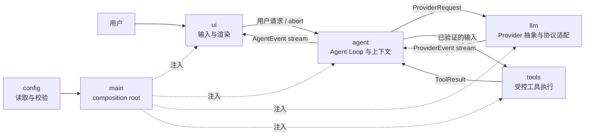
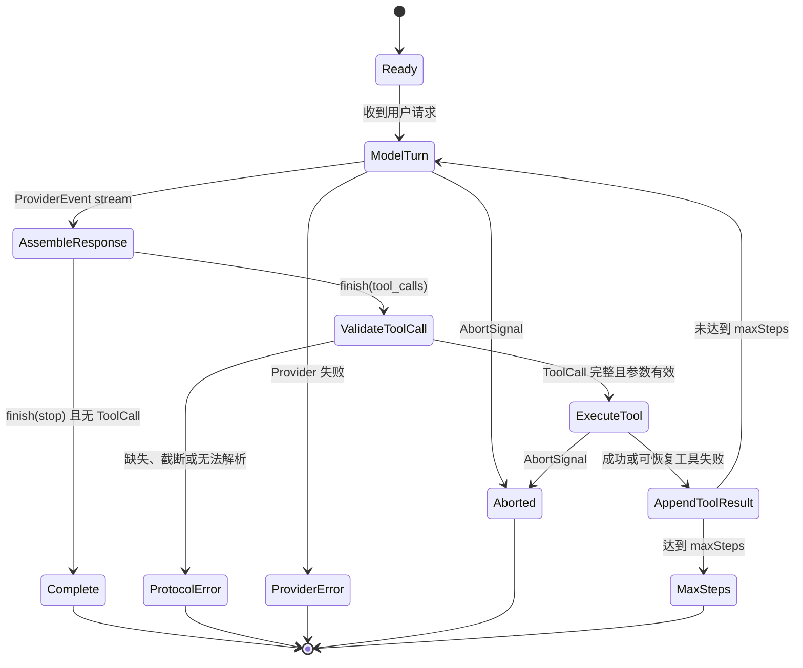

# EasyCode 架构说明

## 1. 文档目的

本文定义 EasyCode 的目标架构、模块边界和关键运行时契约。M0 只建立这些约束与类型级骨架；文中描述的 Agent Loop、Provider、Tool 和 TUI 行为将在后续里程碑逐步实现。

## 2. 架构目标

EasyCode 第一版追求以下属性：

- **自主闭环**：能读取代码、调用工具、观察结果并继续推理，而不是一次性生成文本。
- **中文优先**：默认交互、错误提示和工程文档使用简体中文。
- **可解释**：每次模型请求、工具调用、错误和终止原因都有结构化事件。
- **可测试**：核心循环不依赖网络、终端或真实文件系统，可由 scripted fake 确定性驱动。
- **可控**：工具参数在执行前验证，命令、路径、步数、超时和输出均有边界。
- **轻量**：独立实现关键 Agent 逻辑，只引入当前里程碑确实需要的依赖。

第一版不追求多 Agent、插件市场、远程沙箱、IDE 集成、长期记忆或完整权限系统。详细排除项见 `docs/ROADMAP.md`。

## 3. 总体结构



关键原则是“依赖由外层装配，事件由核心向外发布”。UI 不知道具体 Provider 或工具实现；Provider 不知道 Agent 是否会执行工具；工具也不知道结果将如何展示。

## 4. 目录与职责

```text
src/
  main.ts              # composition root；只装配依赖和启动应用
  agent/
    messages.ts        # Message、ToolCall、ToolResult 等核心会话类型
    events.ts          # UI 可消费的 AgentEvent 与终止原因
    loop.ts            # M1：Agent Loop 状态推进
  llm/
    provider.ts        # Provider、ProviderRequest、ProviderEvent 契约
    openai-compatible/ # M2：OpenAI-compatible 协议适配
  tools/
    tool.ts            # Tool、ToolContext、执行结果契约
    registry.ts        # M1/M3：显式工具注册与查找
  config/
    config.ts          # 配置对象与允许的环境变量名称
  ui/
    app.tsx            # M4：Ink 应用入口
tests/
  unit/                # 纯逻辑与边界测试
  integration/         # 临时 workspace 中的模块组合测试
  fixtures/            # 小型、可审查、无敏感信息的 fixture
evals/
  scenarios/           # 可复现的端到端行为场景
```

上表包含未来文件位置，不代表 M0 已实现对应功能。只有当前确实需要的文件会被创建。

## 5. 依赖方向

允许的生产依赖方向为：

```text
main -> ui -> agent -> llm
                |
                +----> tools

main -> config
```

约束如下：

1. `main` 是唯一 composition root，负责创建配置、Provider、工具注册表、Agent 和 UI。
2. `ui` 依赖 Agent 的公开入口和 `AgentEvent`，不得直接依赖具体 Provider、Node.js 文件系统或子进程。
3. `agent` 依赖抽象 `Provider` 与抽象 `Tool`，不得依赖具体 SDK、Ink 或具体工具。
4. `llm` 只处理模型协议和流式归一化，不调用工具、不维护 Agent 步数、不渲染终端。
5. `tools` 只验证并执行单个能力，不发起模型请求，也不决定下一步行动。
6. `config` 不反向依赖其他业务模块；环境变量只在应用边界读取一次。
7. `tests` 可以依赖生产模块；生产模块不得依赖 `tests` 或 `evals`。

`ProviderEvent` 与 `AgentEvent` 有意分离：前者忠实表达模型流，后者表达产品级执行过程。这个边界避免 UI 被某家模型 API 的 chunk 格式绑死。

## 6. 核心契约

### 6.1 Message 与上下文

`Message` 是 Agent 维护的规范会话表示，包含 `system`、`user`、`assistant` 和 `tool` 四类消息。`AssistantMessage` 保存已完整组装并验证的 `ToolCall`；`ToolMessage` 保存对应 `ToolResult`。

规则：

- UI 文本、模型原始流和工具日志不能直接充当规范历史。
- 流式 ToolCall 在完整结束前只存在于 Provider 适配层的临时缓冲区。
- 只有字段完整、参数可解析且满足 schema 的 ToolCall 才能进入 Agent 历史。
- ToolResult 必须关联 `toolCallId` 与 `toolName`，并显式区分成功和可恢复失败。
- 第一版上下文保存在内存中；压缩、持久化和跨会话恢复后置。

### 6.2 Provider

`Provider` 是模型能力的最小抽象：

```ts
interface Provider {
  readonly name: string;
  stream(request: ProviderRequest, options?: ProviderStreamOptions): AsyncIterable<ProviderEvent>;
}
```

Provider 的职责：

- 将规范请求转换为具体模型协议；
- 解析流式响应；
- 将文本、ToolCall 增量、完成原因和 Provider 错误归一化为 `ProviderEvent`；
- 响应 `AbortSignal`；
- 保留足够错误分类供 Agent 决定终止，但不自行运行 Agent Loop。

Provider 不负责：执行工具、重放整个会话、修改 workspace、终端渲染或自行无限重试。第一种真实实现计划采用 OpenAI-compatible HTTP API，但核心不依赖 OpenAI SDK。

### 6.3 Tool

`Tool<Input>` 将工具元数据、输入解析和执行放在同一边界内：

```ts
interface Tool<Input> {
  readonly name: string;
  readonly description: string;
  readonly inputSchema: ToolInputSchema;
  parse(input: unknown): Input;
  execute(input: Input, context: ToolContext): Promise<ToolExecutionResult>;
}
```

`parse` 是强制安全门。Agent 只能把 `parse` 成功得到的 `Input` 交给 `execute`。工具不存在、参数不完整、JSON 解析失败或 schema 不匹配时，执行函数不得被调用。

工具实现还必须遵守：

- 工作目录由 `ToolContext.cwd` 显式提供；
- 所有长操作响应 `AbortSignal`；
- 输出有长度上限并保留截断说明；
- 文件路径解析后必须位于允许的 workspace root；
- 命令执行默认使用 executable 与 argv，不通过 shell 拼接字符串；
- 可恢复的领域错误返回结构化 ToolResult，编程错误保持异常并由 Agent 归类。

### 6.4 AgentEvent

Agent 对 UI 发布稳定的产品级事件：

| 事件 | 含义 | UI 的典型行为 |
| --- | --- | --- |
| `turn_start` | 新模型轮次开始 | 展示步骤编号与忙碌状态 |
| `assistant_delta` | 助手文本增量 | 流式追加文本 |
| `tool_start` | 已验证工具即将执行 | 展示工具名与安全摘要 |
| `tool_end` | 工具执行完成或可恢复失败 | 展示结果摘要与状态 |
| `error` | Provider、协议或内部错误 | 展示可操作的中文错误信息 |
| `complete` | 循环以明确原因结束 | 解除忙碌状态并展示终止原因 |

UI 只依据事件更新视图，不读取 Agent 内部缓冲区。未来即使将 Ink 替换为其他前端，核心循环也不需要修改。

## 7. Agent Loop 状态机



每次进入 `ModelTurn` 计为一个 step。一次模型轮次可以产生零个或多个完整 ToolCall；第一版按响应顺序串行执行，以获得稳定日志、清晰错误归属和可重复测试。执行完成后将全部 ToolResult 追加到上下文，再进入下一轮。

必须先看到 Provider 的明确结束事件，才能把临时 ToolCall 缓冲区提交为待验证调用。任何半截参数或缺失 ID/name 的调用都进入 `ProtocolError`，不会触发 `tool_start`，更不会调用 `execute`。

## 8. 错误与终止

错误按来源处理：

| 来源 | 示例 | 是否反馈给模型 | 循环行为 |
| --- | --- | --- | --- |
| 可恢复工具错误 | 文件不存在、命令退出码非零 | 是，作为失败 ToolResult | 允许继续下一轮 |
| ToolCall 协议错误 | 参数截断、字段缺失 | 否 | `protocol_error` 终止，工具不执行 |
| Provider 错误 | 鉴权、限流、网络失败 | 否 | 发布错误事件并以 `provider_error` 终止 |
| 用户取消 | Ctrl+C 或调用方 abort | 否 | 取消当前 Provider/工具并以 `aborted` 终止 |
| 步数上限 | 下一轮将超过 `maxSteps` | 否 | 不再请求模型或执行工具，以 `max_steps` 终止 |
| 内部错误 | 不变量被破坏、未知异常 | 否 | 脱敏后报告，安全终止 |

M1 不做自动重试。重试会改变请求次数、费用和时序，应在有明确退避策略、幂等性判断和测试后单独引入。

## 9. Session 与状态

第一版 Session 是进程内对象，拥有：

- 规范 `Message[]` 历史；
- 当前 step 与 `maxSteps`；
- 本次运行的 `AbortController`；
- 只供诊断使用的事件序列或摘要。

Provider、Tool 和 UI 不拥有 Session。M0 不创建会话文件；持久化、恢复、上下文压缩和多会话列表均推迟到证明必要之后。

## 10. 测试与评测策略

测试分三层：

1. **单元测试**：使用 scripted `FakeProvider` 和 fake Tool 覆盖每条状态转换，不访问网络和真实用户文件。
2. **集成测试**：在临时 workspace 中组合 Agent、工具注册表和具体工具，验证路径边界、取消、超时和输出截断。
3. **场景评测**：在 `evals/scenarios/` 中记录可复现任务，真实 Provider 运行与普通 CI 分离，并保存 revision、配置、命令和原始结果。

M1 的最低行为矩阵以 `docs/ACCEPTANCE.md` 中八个场景为准。Fake Provider 必须能按调用轮次输出固定脚本并记录请求，使测试可以断言上下文顺序，而不是只断言最终文本。
