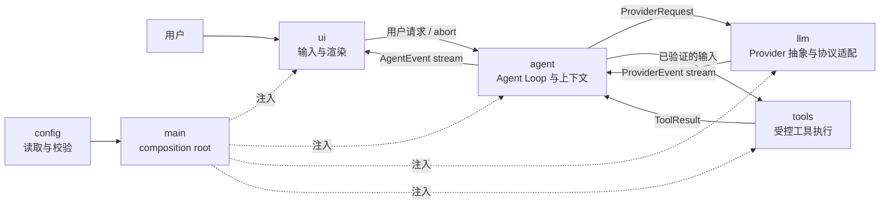
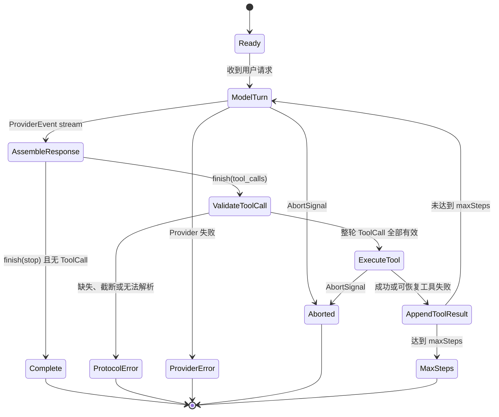

# EasyCode 架构说明

## 1. 文档目的

本文定义 EasyCode 的目标架构、模块边界和关键运行时契约。M4 已实现可由本地 fixture 驱动的 Agent Loop、OpenAI-compatible Provider、受控 workspace 内的最小代码工具集，以及中文 Ink TUI。

## 2. 架构目标

EasyCode 第一版追求以下属性：

- **自主闭环**：能读取代码、调用工具、观察结果并继续推理，而不是一次性生成文本。
- **中文优先**：默认交互、错误提示和工程文档使用简体中文。
- **可解释**：每次模型请求、工具调用、错误和终止原因都有结构化事件。
- **可测试**：核心循环不依赖网络、终端或真实文件系统，可由 scripted fake 确定性驱动。
- **可控**：工具参数在执行前验证，命令、路径、步数、超时和输出均有边界。
- **轻量**：独立实现关键 Agent 逻辑，只引入当前里程碑确实需要的依赖。

第一版不追求多 Agent、插件市场、远程沙箱、IDE 集成、长期记忆或完整权限系统。详细排除项见 `docs/ROADMAP.md`。

## 3. 总体结构



关键原则是“依赖由外层装配，事件由核心向外发布”。UI 不知道具体 Provider 或工具实现；Provider 不知道 Agent 是否会执行工具；工具也不知道结果将如何展示。

## 4. 目录与职责

```text
src/
  main.ts              # composition root；只装配依赖和启动应用
  agent/
    messages.ts        # Message、ToolCall、ToolResult 等核心会话类型
    events.ts          # UI 可消费的 AgentEvent 与终止原因
    loop.ts            # Agent Loop、上下文推进与终止判断
    session.ts         # 进程内会话、运行互斥与历史提交/回滚
  llm/
    provider.ts        # Provider、ProviderRequest、ProviderEvent 契约
    openai-compatible/
      provider.ts      # fetch transport、HTTP 分类与 ProviderEvent 流
      wire.ts          # Chat Completions 请求/响应映射
      sse.ts           # UTF-8 与 SSE 增量解析
      protocol-error.ts # 不携带原始响应的协议异常
  tools/
    tool.ts            # Tool、ToolContext、执行结果契约
    registry.ts        # 显式工具注册、描述与输入准备
    coding-tools.ts    # M3 五个代码工具的显式注册入口
    workspace.ts       # 相对路径、canonical 边界与保留路径策略
    text.ts            # UTF-8、二进制、文件大小与输出上限
    list-directory.ts  # 有界目录列举
    search-files.ts    # 本地 literal 搜索
    read-file.ts       # 文本文件与行范围读取
    apply-patch.ts     # 唯一精确替换与排他创建
    run-command.ts     # shell:false 的受控子进程执行
  config/
    config.ts          # 配置对象与允许的环境变量名称
  ui/
    app.tsx            # Ink 应用、终端输入与 AgentRunner 消费
    input.ts           # Unicode 字素级输入状态机
    model.ts           # AgentEvent 到终端视图的纯状态投影
    format.ts          # 工具、结果、错误与终止原因的安全摘要
tests/
  unit/                # Agent、配置、wire/SSE、HTTP 错误与取消边界
  integration/         # Agent 与具体 Provider 的离线组合测试
  fixtures/            # 小型、可审查、无敏感信息的 fixture
  smoke/               # 默认跳过、需显式启用的真实 API smoke
evals/
  scenarios/           # 可复现的端到端行为场景
```

只有当前里程碑确实需要的文件会进入仓库。

## 5. 依赖方向

允许的生产依赖方向为：

```text
main -> ui -> agent -> llm
                |
                +----> tools

main -> config
```

约束如下：

1. `main` 是唯一 composition root，负责创建配置、Provider、工具注册表、Agent 和 UI。
2. `ui` 依赖 Agent 的公开入口和 `AgentEvent`，不得直接依赖具体 Provider、Node.js 文件系统或子进程。
3. `agent` 依赖抽象 `Provider` 与抽象 `Tool`，不得依赖具体 SDK、Ink 或具体工具。
4. `llm` 只处理模型协议和流式归一化，不调用工具、不维护 Agent 步数、不渲染终端。
5. `tools` 只验证并执行单个能力，不发起模型请求，也不决定下一步行动。
6. `config` 不反向依赖其他业务模块；环境变量只在应用边界读取一次。
7. `tests` 可以依赖生产模块；生产模块不得依赖 `tests` 或 `evals`。

`ProviderEvent` 与 `AgentEvent` 有意分离：前者忠实表达模型流，后者表达产品级执行过程。这个边界避免 UI 被某家模型 API 的 chunk 格式绑死。

## 6. 核心契约

### 6.1 Message 与上下文

`Message` 是 Agent 维护的规范会话表示，包含 `system`、`user`、`assistant` 和 `tool` 四类消息。`AssistantMessage` 保存已完整组装并验证的 `ToolCall`；`ToolMessage` 保存对应 `ToolResult`。

规则：

- UI 文本、模型原始流和工具日志不能直接充当规范历史。
- 流式 ToolCall 在完整结束前只存在于 Agent 当前模型轮次的临时缓冲区，不进入规范历史。
- 只有字段完整、参数可解析且满足 schema 的 ToolCall 才能进入 Agent 历史。
- ToolResult 必须关联 `toolCallId` 与 `toolName`，并显式区分成功和可恢复失败。
- 第一版上下文保存在内存中；压缩、持久化和跨会话恢复后置。

`ProviderMessage` 使用判别联合无损表达历史：assistant 消息携带结构化 `toolCalls`；tool 消息携带 `toolCallId`、`toolName`、内容、`isError` 和可选 metadata。具体 Provider 适配器负责把该规范表示转换为厂商协议。

### 6.2 Provider

`Provider` 是模型能力的最小抽象：

```ts
interface Provider {
  readonly name: string;
  stream(request: ProviderRequest, options?: ProviderStreamOptions): AsyncIterable<ProviderEvent>;
}
```

Provider 的职责：

- 将规范请求转换为具体模型协议；
- 解析流式响应；
- 将文本、ToolCall 增量、完成原因和 Provider 错误归一化为 `ProviderEvent`；
- 响应 `AbortSignal`；
- 保留足够错误分类供 Agent 决定终止，但不自行运行 Agent Loop。

Provider 不负责：执行工具、重放整个会话、修改 workspace、终端渲染或自行无限重试。首个具体实现是 `OpenAICompatibleProvider`，使用 Node.js 内建 `fetch` 和可注入 `FetchTransport`，核心不依赖 OpenAI SDK。

该适配器只承诺经过测试的 Chat Completions 子集：

- 向保留 `baseUrl` 前缀的 `/chat/completions` 发起流式 `POST`，发送 `system`、`user`、`assistant`、`tool` 消息和 `function` 工具定义；
- assistant ToolCall 保持结构化 `id`、name 与 JSON arguments；ToolResult 使用稳定 JSON envelope 编码 `tool_name`、`is_error`、output 与可选 metadata，避免丢失 EasyCode 语义；
- SSE 解析支持 UTF-8 跨字节、LF/CRLF、跨网络 chunk、单 chunk 多事件、注释、空行、usage-only chunk 和 `[DONE]`；
- 只接受 `choice.index === 0`，并将 `stop`、`tool_calls`、`length` 映射为明确事件；`content_filter`、旧式 `function_call`、未知完成原因、无明确 finish 的 EOF 和 finish 后尾随数据均拒绝为协议错误；
- HTTP 鉴权、限流、服务端、其他状态、网络与协议错误使用稳定分类；错误正文、认证 header 与底层异常文本不向 Agent 透传；
- 调用方的同一个 `AbortSignal` 传入 `fetch` 和流 reader，取消优先保留为 abort，而不是伪装成 Provider 错误。

配置只由 `src/config/config.ts` 在应用边界读取 `EASYCODE_API_KEY`、`EASYCODE_BASE_URL` 与 `EASYCODE_MODEL`。业务模块接收已校验配置，不自行读取 `process.env`。

ToolCall 事件遵守以下协议：

- `index` 是从 0 开始的连续非负整数，决定一轮内的执行顺序；
- 同一 `index` 只能使用完整 `tool_call`，或使用一组 `tool_call_delta`，不得混用；
- 增量事件中的 `id` 与 `name` 是稳定完整字段，重复出现时值必须一致；只有 `argumentsDelta` 进行字符串拼接；
- Agent 必须收到唯一明确的 `finish` 后才能提交缓冲区；流提前结束、`length`、尾随事件或 JSON 不完整均视为协议错误；
- 完整事件与增量事件最终收敛为同一种 `ToolCall`，因此不会重复执行。

### 6.3 Tool

`Tool<Input>` 将工具元数据、输入解析和执行放在同一边界内：

```ts
interface Tool<Input> {
  readonly name: string;
  readonly description: string;
  readonly inputSchema: ToolInputSchema;
  parse(input: unknown): Input;
  execute(input: Input, context: ToolContext): Promise<ToolExecutionResult>;
}
```

`parse` 是强制安全门。ToolRegistry 用泛型包装保留解析结果与执行输入的类型关系。Agent 会先组装并解析当前响应中的全部 ToolCall；只有整轮全部通过，才追加 assistant 历史并开始按 index 串行执行。工具不存在、参数不完整、JSON 解析失败或 schema 不匹配时，本轮所有执行函数都不会被调用。

`ToolExecutionResult.isError` 明确区分成功和可恢复领域失败。可恢复失败会转换为 `ToolResult` 回传模型；工具抛出的未知异常属于内部错误，不得伪装成失败或成功 ToolResult。

工具实现还必须遵守：

- 工作目录由 `ToolContext.cwd` 显式提供；
- 所有长操作响应 `AbortSignal`；
- 输出有长度上限并保留截断说明；
- 文件路径解析后必须位于允许的 workspace root；
- 命令执行默认使用 executable 与 argv，不通过 shell 拼接字符串；
- 可恢复的领域错误返回结构化 ToolResult，编程错误保持异常并由 Agent 归类。

M3 的具体边界如下：

- `list_directory`、`search_files`、`read_file`、`apply_patch` 与 `run_command` 由 `createCodingToolRegistry()` 显式注册，不提供同义工具或动态发现；
- 所有模型路径先按 workspace 相对路径校验，再通过 `realpath`/canonical 路径确认实际目标仍在 root 内；`.git`、`.easycode` 与真实 `.env*` 均为保留路径；
- 目录遍历按稳定顺序执行，不跟随 symlink/junction，并限制深度、条目、扫描文件、匹配数、单文件大小与返回 bytes；直接 symlink 不作为普通文件或目录读取，写入路径中的内部 symlink parent 只有在 canonical parent 仍位于 workspace 时才允许；
- `apply_patch` 只支持唯一精确替换和排他创建，不支持删除或重命名；更新写入同目录临时文件并在提交前复查原内容，创建通过排他目标语义拒绝覆盖；
- `run_command` 只接受结构化 `executable`、`args`、workspace 相对 `cwd` 与有界 `timeoutMs`，使用 `shell:false`，过滤敏感环境变量，并拒绝 shell、inline eval、危险 Git、发布、部署与系统级命令；
- Windows 的 `npm.cmd`/`.bat` shim 不能在不经过 shell 的前提下可靠启动，因此 M3 明确拒绝这类入口。可直接执行真实 binary，或使用 Node.js 执行 workspace 内已有脚本；后续若支持 package scripts，必须设计不扩大 shell 注入面的独立适配。

这些控制降低误操作和注入风险，但不是 OS 级沙箱：允许的进程仍继承当前用户权限，终止只保证直接子进程收到停止请求，M3 不承诺隔离其自行创建的所有后代进程。canonical 检查和 patch 提交前复查也不能完全消除具有同一宿主权限的恶意本地进程制造的 TOCTOU 竞态。

### 6.4 AgentEvent

Agent 对 UI 发布稳定的产品级事件：

| 事件 | 含义 | UI 的典型行为 |
| --- | --- | --- |
| `turn_start` | 新模型轮次开始 | 展示步骤编号与忙碌状态 |
| `assistant_delta` | 助手文本增量 | 流式追加文本 |
| `tool_start` | 已验证工具即将执行 | 展示工具名与安全摘要 |
| `tool_end` | 工具执行完成或可恢复失败 | 展示结果摘要与状态 |
| `error` | Provider、协议或内部错误 | 展示可操作的中文错误信息 |
| `complete` | 循环以明确原因结束 | 解除忙碌状态并展示终止原因 |

UI 只依据事件更新视图，不读取 Agent 内部缓冲区。即使未来将 Ink 替换为其他前端，核心循环也不需要修改。

`AgentLoop.run()` 是异步生成器：事件用于实时展示，生成器最终返回 `AgentRunResult`，其中包含终止原因、最终 step 和规范消息快照，供 composition root 管理内存会话与测试断言。

## 7. Agent Loop 状态机



每次进入 `ModelTurn` 计为一个 step。进入下一轮前先检查 `maxSteps`，因此不会额外请求一次 Provider。一次模型轮次可以产生零个或多个完整 ToolCall；第一版按 `index` 顺序串行执行，以获得稳定日志、清晰错误归属和可重复测试。执行完成后将全部 ToolResult 追加到上下文，再进入下一轮。

必须先看到 Provider 的明确结束事件，才能把临时 ToolCall 缓冲区提交为待验证调用。任何半截参数或缺失 ID/name 的调用都进入 `ProtocolError`，不会触发 `tool_start`，更不会调用 `execute`。

## 8. 错误与终止

错误按来源处理：

| 来源 | 示例 | 是否反馈给模型 | 循环行为 |
| --- | --- | --- | --- |
| 可恢复工具错误 | 文件不存在、命令退出码非零 | 是，作为失败 ToolResult | 允许继续下一轮 |
| ToolCall 协议错误 | 参数截断、字段缺失 | 否 | `protocol_error` 终止，工具不执行 |
| Provider 错误 | 鉴权、限流、网络失败 | 否 | 发布错误事件并以 `provider_error` 终止 |
| 用户取消 | Ctrl+C 或调用方 abort | 否 | 取消当前 Provider/工具并以 `aborted` 终止 |
| 步数上限 | 下一轮将超过 `maxSteps` | 否 | 不再请求模型或执行工具，以 `max_steps` 终止 |
| 内部错误 | 工具抛出未知异常、不变量被破坏 | 否 | 脱敏后报告，以 `internal_error` 安全终止 |

M2 不做自动重试。Provider 只标记 `retryable`，重试会改变请求次数、费用和时序，应在有明确退避策略、幂等性判断和测试后单独引入。

## 9. Session 与状态

`AgentSession` 是 UI 与 `AgentLoop` 之间的进程内边界，持有已提交的规范 `Message[]` 历史并通过 `AgentRunner` 接口发布带 `runId` 的事件。其规则是：

- 初始历史只包含固定中文 system prompt；每次提交把当前 user 消息作为候选历史交给 Agent Loop；
- 只有 `complete` 才提交本次返回的规范历史；`aborted`、`provider_error`、`protocol_error`、`internal_error` 与 `max_steps` 全部回滚；
- 同一 Session 同时只允许一个活动 run，忙碌时拒绝新提交；`runId` 单调递增，UI 可以丢弃旧 run 的迟到事件；
- 调用方创建并拥有 `AbortController`，同一个 `AbortSignal` 从 UI 透传到 Agent、Provider 和 Tool；Session 不伪造取消结果；
- `maxSteps` 仍属于 `AgentLoop` 的单次运行配置，不由 UI 修改。

Provider、Tool 和 UI 不直接拥有或修改规范历史。M4 不创建会话文件；持久化、恢复、上下文压缩和多会话列表继续后置。

## 10. 中文 Ink TUI

TUI 是 `AgentEvent` 的轻量投影，而不是新的业务层：

- `EasyCodeApp` 只依赖 `AgentRunner`，不知道 OpenAI-compatible Provider、具体工具、文件系统或子进程；真实依赖只在 `src/main.ts` 装配；
- `uiReducer` 确定性聚合流式 assistant 文本，按调用 ID 关联工具开始与结束，并忽略旧 run、迟到事件和重复终止事件；
- 输入状态机按 Unicode 字素移动和删除，支持中文、组合字符、emoji 与粘贴规范化；输入、assistant 文本、transcript 和安全摘要均有显式上限；
- 工具展示只使用白名单字段和 metadata，不默认渲染完整文件、patch 内容或命令输出，并在显示前清理控制字符、隐藏常见凭据；
- 运行中第一次 `Ctrl+C` abort 当前 run 并进入“取消中”，再次按下只请求在清理完成后退出；空闲时 `Ctrl+C` 直接退出；
- 单列布局在 120、80、60、40 列下使用终端硬换行；设置 `NO_COLOR` 时不输出颜色控制序列。

`src/main.ts` 是唯一 composition root：从环境变量读取配置，以真实 `process.cwd()` 创建工具上下文，以固定 `maxSteps` 创建 Agent Loop 和 Session，再启动 Ink。配置失败在 Ink 启动前通过稳定中文错误退出；CLI 由 `package.json` 的 `easycode` bin 指向带 shebang 的 `dist/main.js`。

## 11. 测试与评测策略

测试分三层：

1. **单元测试**：使用 scripted `FakeProvider`、fake Tool、注入的 fake `fetch` 与本地 SSE fixture 覆盖状态转换和协议边界，不访问网络和真实用户文件。
2. **集成测试**：离线组合 Agent、具体 Provider 和 Tool；M2 验证跨 chunk ToolCall，M3 在临时 workspace 中用真实工具验证“搜索/读取—修改—命令验证—最终回答”及失败 ToolResult 回传。
3. **可选 smoke**：只有设置 `EASYCODE_SMOKE=1` 才读取三个 Provider 环境变量并请求真实服务，普通 `npm test` 与 CI 默认跳过。
4. **场景评测**：在 `evals/scenarios/` 中记录可复现任务，真实 Provider 运行与普通 CI 分离，并保存 revision、配置、命令和原始结果。

M1 的最低行为矩阵以 `docs/ACCEPTANCE.md` 中八个场景为准。M2 进一步以本地 fixture 断言 wire 格式、SSE 字节边界、完成语义、错误脱敏、reader 清理和取消传播；M3 以临时 workspace 断言路径边界、资源上限、原子修改、命令控制和 Agent 闭环；M4 使用 `ink-testing-library` 与纯 reducer 测试覆盖中文输入、流式渲染、工具摘要、取消、会话提交/回滚及 40–120 列布局。默认测试不访问网络、用户仓库或真实 API。
